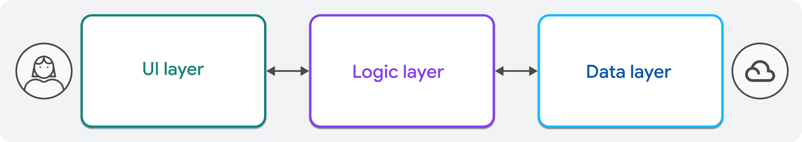

## Общие концепции архитектуры

В этом разделе вы найдете проверенные и верные принципы, которыми руководствуются при принятии архитектурных решений в мире разработки приложений, а также информацию о том, как они применимы в специфике Flutter. 

Это легкое введение в терминологию и понятия, связанные с рекомендуемой архитектурой и лучшими практиками, чтобы их можно было изучить более подробно на протяжении всего руководства.

### Разделение ответственности

[Разделение ответственности](https://ru.wikipedia.org/wiki/%D0%A0%D0%B0%D0%B7%D0%B4%D0%B5%D0%BB%D0%B5%D0%BD%D0%B8%D0%B5_%D0%BE%D1%82%D0%B2%D0%B5%D1%82%D1%81%D1%82%D0%B2%D0%B5%D0%BD%D0%BD%D0%BE%D1%81%D1%82%D0%B8) - это основной принцип разработки приложений, который способствует моудльности и удобству обслуживания за счет разделения функцуиональности приложения на отдельные, самодостаточные блоки. 

На высоком уровне, это означает разделение логики пользовательского интерфейса и бизнес-логики. 

Это часто описывается как *многоуровневая архитектура*. Внутри каждого слоя вы должны разделить приложение по функциям. 

Например, логика аутентификации в вашем приложении должна находиться в другом классе, чем логика поиска. 

Во Flutter это относится и к виджетам в UI-слое. Вы должны писать переиспользуемые, компактные виджеты, которые содержат как можно меньше логики. 

### Слоистая архитектура
Flutter-приложения должны быть написаны слоями. Слоистая архитектура - это шаблон проектирования программного обеспечения, который организует приложение на отдельные слои, каждый из которых имеет определенные роли и обязанности. 

Как правило, приложения разделеяются на 2-3 слоя, в зависимости от сложности. 

- **UI-слой**
Отображает данные для пользователя, которые открыты слоем бизнес-логики, и обрабатывает взаимодействие с пользователем. Его также принято называть слоем "презентации"

- **Логический слой**
Реализаует основную бизнес-логику и обеспечивает взаимодействие между слоем данных и слоем пользовательского интерфейса. Также известен как "доменный слой". Логический слой является необязательным, и его необходимо реализовывать только в том случе, если ваше приложение имеет сложную бизнес-логику, которая выполняется на клиенте. 

Многие приложения занимаются только тем, что представляют данные пользователю и позволяют ему изменятьт эти данные (в просторечии их называют CRUD-приложениями). Таким приложениям этот дополнительный слой может и не понадобиться. 

- **Слой данных**
Управляет взаимодействием с источником данных, такими как базы данных или плагнины платформы. Предоставялет данные и методы слою бизнес-логики. 

Эти сущности называются слоями, потому что каждый слой может взаимодействовать только со слоями, расположенными непосредственно под или над ним. Слой UI-слой не должен знать о существовании слоя данных и наоборот. 

## Единый источник истины
Каждый тип данных в вашем приложении должен иметь единый источник истины ([SSOT](https://en.wikipedia.org/wiki/Single_source_of_truth)). Источник истины отвечает за представление локального или удаленного состояния. Если данные  могут быть изменены в приложении, класс SSOT должен быть единственным классом, который может это делать. 

Это может значительно сократить количество ошибок в вашем приложении и упростить код, поскольку у вас будет только одна копия одних и тех же данных.

Как правило, источник истины для любого типа данных в вашем приложении находится в клда