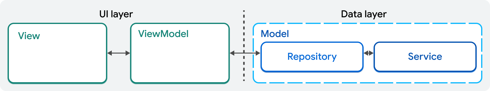
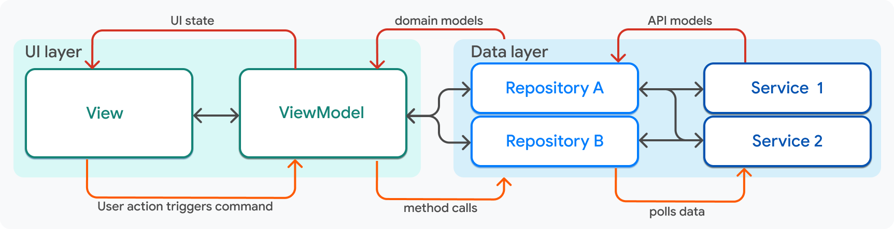

## Руководство к построению архитектуры приложения

На следующих страницах показано, как создать приложение, используя лучшие практики. Рекомендации, приведенные в этом руководстве, могут быть применены к большинству приложений, что облегчает их масштабирование, тестирование и поддержку. Однако это именно **_рекомендации, а не непреложные правила, и вы должны адаптировать их к своим уникальным требованиям_**.

В этом разделе дается высокоуровневый обзор того, как могут быть спроектированы приложения Flutter. В нем объясняются слои приложения, а также классы, существующие в каждом слое. В следующем разделе приведены конкретные примеры кода и рассмотрено приложение Flutter, в котором реализованы эти рекомендации.

### Обзор структуры проекта

[Разделение ответственности](https://ru.wikipedia.org/wiki/%D0%A0%D0%B0%D0%B7%D0%B4%D0%B5%D0%BB%D0%B5%D0%BD%D0%B8%D0%B5_%D0%BE%D1%82%D0%B2%D0%B5%D1%82%D1%81%D1%82%D0%B2%D0%B5%D0%BD%D0%BD%D0%BE%D1%81%D1%82%D0%B8) - самый важный принцип, которому нужно следовать при разработке приложения на Flutter. Ваше приложение Flutter должно быть разделено на два больших слоя: слой пользовательского интерфейса (**UI-слой**) и слой данных (**Data-слой**).

Каждый слой делится на различные компоненты, у каждого из которых есть свои обязанности, четко определенный интерфейс, границы и зависимости. В этом руководстве рекомендуется разделить ваше приложение на следующие компоненты:

- **View** (Представление)
- **ViewModel** (Модель представления)
- **Repository** (Репозиторий)
- **Services** (Сервисы)

### MVVM

Если вы сталкивались с паттерном проектирования [Model-View-ViewModel (MVVM)](), это будет вам знакомо. MVVM - это паттерн проектирования, который разделяет функциональность приложения на три части: Model, ViewModel и View.

View и ViewModel составляют слой пользовательского интерфейса приложения. Репозитории и сервисы представляют данные приложения, или слой Model MVVM. Каждый из этих компонентов определяется в следующем разделе.

Каждая фича в приложении будет содержать один **View** для описания пользовательского интерфейса и один **ViewModel** для обработки логики, один или несколько **репозиториев** в качестве источников истины для данных приложения, а также ноль или несколько **сервисов**, которые взаимодействуют с внешними API, такими как клиентские серверы и плагины для платформы.

Для одной фичи приложения могут потребоваться все следующие объекты:

Каждый из этих объектов и соединяющие их стрелки будут подробно описаны в конце этой страницы. В данном руководстве в качестве опорной будет использоваться упрощенная версия этой диаграммы.

> [!Примечание]  
> Приложения со сложной логикой могут иметь логический слой, который располагается между слоем пользовательского интерфейса и слоем данных. Этот логический слой обычно называют **доменным слоем**. Доменный слой содержит дополнительные компоненты, часто называемые **интеракторами** или **сценариями использования (use-case)**. Доменный слой рассматривается далее в этом руководстве.

### UI слой
